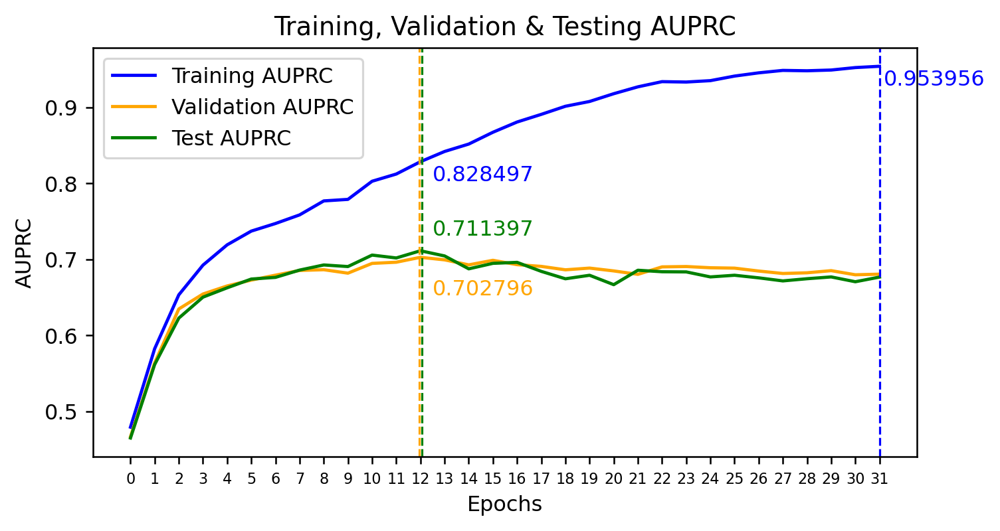

# pytorch-variational-gcn-ehr
Variational Graph Convolutional Network (GCN) for EHR (Electronic Health Record) in PyTorch.

An attempt to reproduce the paper below.

## About the paper

+ Original Research Paper: [Variationally Regularized Graph-based Representation Learning for Electronic Health Records (Zhu et al., 2021)](https://arxiv.org/abs/1912.03761)
+ Original Source Code: [GNN_for_EHR](https://github.com/NYUMedML/GNN_for_EHR)

I found this paper after having read the Review Paper: [Disease Prediction Using Graph Machine Learning Based on Electronic Health Data: A Review of Approaches and Trends (Lu et al., 2023)](https://pubmed.ncbi.nlm.nih.gov/37046958/)

## Data

+ [MIMIC-III](https://physionet.org/content/mimiciii/1.4/)
  + 50,314 records, 10,591 features (multi-hot encoding)
  + 5,315 positive, 44,999 negative (11.8%)
  + Split: 80% training, 10% validation, 10% testing

Note: the **full** dataset of MIMIC-III.

There are other datasets as well as other tasks in the paper, but here I focus on **Mortality Prediction (in 24 hours after ICU admission) for MIMIC-III**.

The raw dataset doesn't have *clearly defined features*. One has to feature-engineer it. The final features consist of ICD9 Diagnose Code, ICD9 Procedure Code, and LabValue. The Lab values are categorized into ranges of standard deviation `['-10', '-3', '-1', '-0.5', '0.5', '1', '3', '10']`. Specifically,

```
# File "preprocess_mimic.py" (original source code).
suffix = "_(>10)"
for lab_range in ['-10', '-3', '-1', '-0.5', '0.5', '1', '3', '10']:
    if lab_value < float(lab_range) * std + mean:
        suffix = "_({})".format(lab_range)
            break
...
encounter_dict[encounter_id].labvalues.append(lab_id + suffix)
```

Each Lab Type has its own `std` and `mean`, calculated from the entire dataset.

Note: The LimitedData folder in this repo is the preprocessing result of MIMIC-III (**demo** version ([link](https://physionet.org/content/mimiciii-demo/1.4/))). The **full** version is not readily available unless users is credentialed. See [link](https://physionet.org/content/mimiciii/1.4/).

## Result

Max **AUPRC 0.7027** (Baseline: 0.118) on Val split



## Live Demo

[mortality_prediction on Huggingface Space](https://huggingface.co/spaces/tnt306/mortality_prediction)

## Some changes and (hopefully) improvements, compared to the original:

+ Remove the use of `torch.nn.DataParallel` because it is recommended to use DistributedDataParallel to do multi-GPU training, even if there is only a single node. ([link](https://pytorch.org/docs/stable/generated/torch.nn.DataParallel.html))
+ Move the addition of 2 into the number of feature nodes `num_of_nodes` within class `VariationalGNN`. Otherwise, it would cause confusion.
  + Each patient is represented with a X number of features (encoded as multi-hot). Each feature is a node in a **fully connected graph**. However, there are additionally 2 nodes appended to the graph (the 1st one and the last one). The 1st one serves as a convenience of computation when some patients have no condition! (can be understood *loosely* as the patient is absolutely normal). The last one will be used to absorb all other nodes of *the* patient, and is used to make prediction for *the* patient.
+ Due to unbalanced data in MIMIC-III, the upsampling is 2, according to the paper. But code is hardcoded with 1 for upsampling. ➔ Fixed.
+ Move the creation of train_loader (`DataLoader`) outside of epoch loop as no need to re-create it every epoch. When we start to `enumerate()` the train_loader, its index gets reset automatically.
+ In `BCEWithLogitsLoss`, the `pos_weight` was used incorrectly. It should be "the ratio between the negative counts and the positive counts". ([link](https://pytorch.org/docs/stable/generated/torch.nn.BCEWithLogitsLoss.html)) ➔ Fixed.
+ A bug in function `encoder_decoder()`, in section `variational`, here `data` is a multi-hot encoding, selecting `mu` and `logvar` based on indices of 0 and 1 doesn't make sense. ➔ Fixed.

```
# original source code:
h_prime = self.reparameterise(mu, logvar)
mu = mu[data, :]
logvar = logvar[data, :]
```
+ The code uses `StepLR` but the paper suggests "half the learning rate if the AUPRC stops growing for two epochs". I changed to using `ReduceLROnPlateau` instead to reflect idea in the paper.
+ The paper suggests "For MIMIC-III and eICU, since the label are less imbalanced, we only upsample the positive samples 2 time", but the upsampling rate was hardcoded with 1. I changed to 2.
+ Save the model every epoch so that one can draw the AUPRC later for training, validation and testing data.
+ In the preprocessing data of MIMIC-III, I sorted the features according to their names so that when later viewing csv data of a test patient, it will be more enjoyable.

## Training

1. Download **full** MIMIC-III dataset. (`mimic-iii-clinical-database-1.4.zip` 6.17 GB)
2. Run `preprocess_mimic.py` against this dataset.
   - End up with `train_csr.pkl`, `validation_csr.pkl` and `test_csr.pkl`, needed for training.
   - Put those in `data` folder.
3. Run `train.py`.
   - Model will saved each epoch, coupled with the AUPRC Val.
     - Through this, we know which trained model has best performance. Plus, draw AUPRC graph for training, validation, testing.

## Environment

+ NVIDIA A100-SXM4-40GB
+ Python 3.11.5 (64 bit)
+ PyTorch 2.4.0
+ OS: Ubuntu 22.04 (Kernel: 5.15.0-91-generic)
